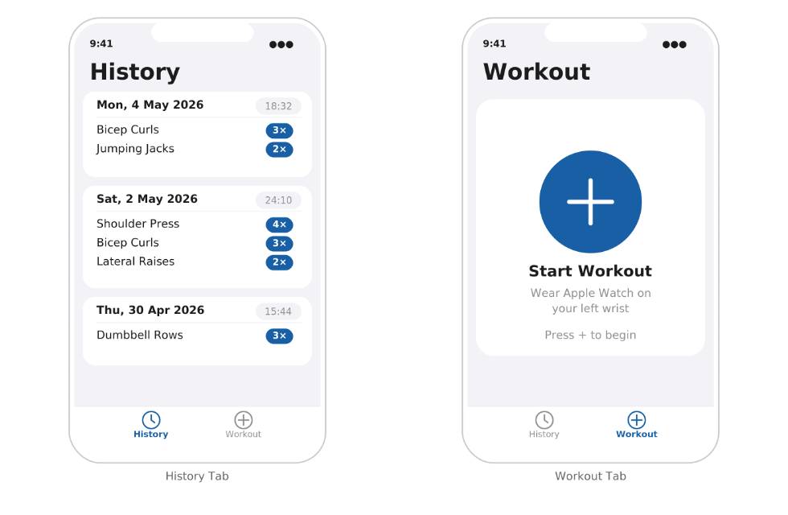

# Classify 🏋️

Bachelorarbeit an der FH Technikum Wien: Vergleich von 1D-CNN und Random Forest
zur Klassifikation von 11 Fitnessübungen anhand von Handgelenk-IMU-Daten
(Apple Watch, 50 Hz) – mit Deployment als native watchOS-App.

---

## 📱 App Preview

  

---

## 🛠️ Tech Stack

**ML & Training**

**Deployment**

---

## ✨ Was die App kann

- Fitnessübungen in Echtzeit erkennen (10 Kraftübungen + Non-Exercise)
- IMU-Daten vom Handgelenk erfassen und klassifizieren
- Ergebnis direkt auf der Apple Watch anzeigen

---

## ⚙️ Wie ich es gebaut habe

1. **Datenvorbereitung** – MM-Fit Dataset (Modalität `sw_r`, 50 Hz),
   Sliding Window (250 Samples, Stride 25), Achsenkorrektur für linkes Handgelenk
2. **Modellentwicklung** – Vergleich von 1D-CNN (Dual-Branch für Acc/Gyro)
   und Random Forest mit 114 handcrafted Features
3. **Hyperparameter-Optimierung** – Optuna mit TPE Sampler + PercentilePruner,
   Experiment Tracking via MLflow
4. **Deployment** – CoreML Export musste manuell via MIL gebaut werden
   (Workaround für TF 2.16 XLA-Bug), Inferenz via Majority Vote
5. **watchOS App** – Swift, WCSession `transferUserInfo()` statt `sendMessage()`
   (IDS Bluetooth Timeout bei 50 Hz)

**Bestes Ergebnis:** CNN V3-C – Macro-F1 = **0.8946** auf ungesehenen Testdaten

---

## 💡 Was ich gelernt habe

Machine Learning funktioniert nicht per Zauberhand. Man kann nicht einfach ein
Modell mit Daten füttern und erwarten dass es automatisch alles lernt.
Was wirklich den Unterschied macht:

- **Feintuning ist alles** – Hyperparameter-Optimierung, Datenaufbereitung
  und Modellarchitektur entscheiden über Erfolg oder Misserfolg
- **Gute Zahlen ≠ gutes Deployment** – ein hoher Accuracy-Wert bedeutet nicht,
  dass das Modell in der realen Welt genauso gut funktioniert
- **Versionierung von Anfang an** – MLflow und ähnliche Tools (z.B. Neptune)
  sind kein Nice-to-have, sondern essentiell um den Überblick zu behalten
- **Google Colab als Gamechanger** – GPU-Training (T4) war kostenlos möglich,
  auch ohne leistungsstarke Hardware. Ein MacBook Air reicht völlig aus,
  wenn man die richtigen Tools kennt
- **AI als Werkzeug** – Claude Code hat mir enorm geholfen, vor allem für Swift
  und CoreML, Sprachen die ich vorher nicht kannte. Wenn man AI gut führen kann,
  kann man damit Dinge umsetzen die weit über das eigene aktuelle Wissen hinausgehen

---

## 🔧 Was man verbessern könnte

- Mehr und vielfältigere Trainingsdaten – am besten selbst aufgezeichnet,
  von mehreren Personen mit verschiedenen Bewegungsmustern
- Dadurch würden auch aktuell unzuverlässige Klassen (Squats, Push-ups,
  Lateral Raises) besser klassifiziert werden

---

## 🚀 How to Run

### watchOS App
1. Xcode öffnen und `Classify.xcodeproj` laden
2. iPhone und Apple Watch verbinden
3. Build & Run auf dem Gerät

> **Voraussetzungen:** Mac, Xcode, iPhone, Apple Watch

### ML Training
Der Trainingscode befindet sich im `ml/` Ordner.
Die Notebooks wurden auf Google Colab mit T4 GPU ausgeführt.

> **Voraussetzungen:** Python, TensorFlow, scikit-learn, Optuna, MLflow  
> Empfehlung: Google Colab für GPU-Zugang
